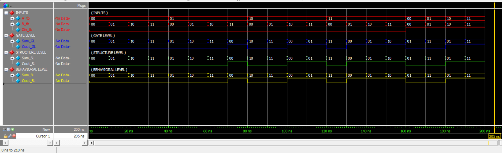

# 2-Bit Full Adder

## Overview

This task implements and verifies a **2-bit Full Adder** using three different Verilog modeling styles:

- Gate-Level Modeling
- Structural Modeling
- Behavioral Modeling

The three implementations perform the same arithmetic operation:

```text
A + B + Cin
```

The outputs are a 2-bit `Sum` and a 1-bit `Cout`.

The purpose of the task is to compare different Verilog abstraction levels and verify that they produce identical results.

---

## Design Architecture

The 2-bit Full Adder consists of two 1-bit full-adder stages connected through a carry signal.

```text
          ┌─────────────┐
A[0] ────►│             │
B[0] ────►│  Bit 0 FA   │──── Sum[0]
Cin ─────►│             │
          └──────┬──────┘
                 │ Carry
                 ▼
          ┌─────────────┐
A[1] ────►│             │
B[1] ────►│  Bit 1 FA   │──── Sum[1]
          │             │
          └──────┬──────┘
                 │
                 ▼
               Cout
```

---

# 1. Verilog Implementations

## 1.1 Gate-Level Implementation

The Gate-Level implementation describes the circuit using basic logic gates such as:

- XOR
- AND
- OR

Each bit is implemented directly using logic gates.

### Main Module

```verilog
module FA_2bit_GL (
    input wire [1:0] A,
    input wire [1:0] B,
    input wire       Cin,
    output wire [1:0] Sum_GL,
    output wire       Cout_GL
);
```

The complete implementation is available in:

**[Gate-Level.v](Gate-Level.v)**

---

## 1.2 Structural Implementation

The Structural implementation builds the 2-bit Full Adder using multiple instances of a 1-bit Half Adder.

The 1-bit Half Adder implements:

```text
Sum  = A XOR B
Cout = A AND B
```

Two Half Adders are used for each bit, with OR gates used to combine the carry signals.

### Half Adder Module

```verilog
module HA_1bit (
    input wire A,
    input wire B,
    output wire Sum_HA,
    output wire Cout_HA
);

    xor u1 (Sum_HA, A, B);
    and u2 (Cout_HA, A, B);

endmodule
```

The complete files are available here:

- **[Structural.v](Structural.v)**
- **[Half_Adder_1bit.v](Half_Adder_1bit.v)**

---

## 1.3 Behavioral Implementation

The Behavioral implementation describes the required arithmetic operation directly using an `always @(*)` block.

```verilog
always @(*) begin
    {Cout_BL, Sum_BL} = A + B + Cin;
end
```

This provides the same functional behavior as the Gate-Level and Structural implementations.

The complete module is available in:

**[Behavioral.v](Behavioral.v)**

---

# 2. Testbench

A common testbench was used to verify all three implementations simultaneously.

The same inputs are connected to:

```text
             ┌──────────────────┐
             │  Gate-Level FA   │
             └────────┬─────────┘
                      │
Inputs ───────────────┼──────────────► Outputs
                      │
             ┌────────┴─────────┐
             │ Structural FA    │
             └────────┬─────────┘
                      │
             ┌────────┴─────────┐
             │ Behavioral FA    │
             └──────────────────┘
```

The testbench checks the outputs of all three implementations for the applied input combinations.

It covers:

- `Cin = 0`
- `Cin = 1`
- Different combinations of `A` and `B`
- Carry generation cases
- Comparison between Gate-Level, Structural, and Behavioral outputs

The complete testbench is available in:

**[Testbench.v](Testbench.v)**

---

# 3. Simulation Results

The simulation was performed using **Questa Sim 2024.1**.

The results show that the three implementations produce identical `Sum` and `Cout` values for all tested input combinations.

### Selected Results

| A | B | Cin | Sum | Cout |
|---|---|-----|-----|------|
| 00 | 00 | 0 | 00 | 0 |
| 00 | 01 | 0 | 01 | 0 |
| 01 | 01 | 0 | 10 | 0 |
| 01 | 11 | 0 | 00 | 1 |
| 10 | 10 | 0 | 00 | 1 |
| 11 | 11 | 0 | 10 | 1 |
| 00 | 00 | 1 | 01 | 0 |
| 01 | 01 | 1 | 11 | 0 |
| 10 | 10 | 1 | 01 | 1 |
| 11 | 11 | 1 | 11 | 1 |

The complete simulation transcript is available in:

**[transcript](Results/transcript)**

---

# 4. Waveforms

## 4.1 Binary Waveform

The binary waveform shows the input signals and the corresponding outputs from the three Full Adder implementations.



---

## 4.2 Decimal Waveform

The decimal waveform provides another representation of the simulation results for easier numerical interpretation.


---

# 5. Verification

The three implementations were verified using the same testbench and input conditions.

For every tested case:

```text
Gate-Level Output = Structural Output = Behavioral Output
```

The simulation completed successfully with:

```text
Errors   : 0
```

The results confirm that all three modeling styles implement the same 2-bit Full Adder functionality.

---

# 6. Files

| File | Description |
|------|-------------|
| [Gate-Level.v](Gate-Level.v) | Gate-Level 2-bit Full Adder |
| [Structural.v](Structural.v) | Structural 2-bit Full Adder |
| [Behavioral.v](Behavioral.v) | Behavioral 2-bit Full Adder |
| [Half_Adder_1bit.v](Half_Adder_1bit.v) | 1-bit Half Adder used in the Structural design |
| [Testbench.v](Testbench.v) | Verification testbench |
| [transcript](Results/transcript) | Questa simulation transcript |
| [WaveForm_Binary.png](Results/WaveForm_Binary.png) | Binary waveform |
| [WaveForm_Decimal.png](Results/WaveForm_Decimal.png) | Decimal waveform |

---

# Conclusion

The 2-bit Full Adder was successfully implemented using Gate-Level, Structural, and Behavioral Verilog modeling styles.

The simulation results show that all three implementations produce identical outputs for the tested input combinations. This confirms the functional equivalence of the three implementations.
