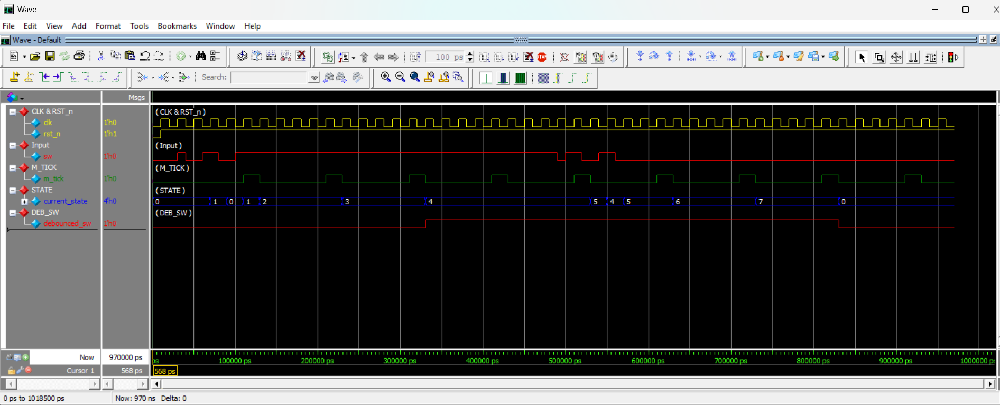

# Debounce FSM

A Verilog implementation of a switch debouncing circuit built as a Moore Finite State Machine (FSM), verified through simulation with a self-checking testbench.

## 1. Overview

This project implements a digital switch debouncer using an FSM-based approach instead of a simple counter-based debouncer. The design filters out mechanical switch bounce (rapid, unintended toggling of a signal when a physical switch changes state) and produces a clean, stable output signal, `debounced_sw`, only after the raw input `sw` has remained stable for a defined interval.

The project consists of two cooperating modules:

1. **Clock Divider / `m_tick` Generator** — produces a periodic timing pulse.
2. **Debounce FSM** — a Moore state machine that uses that pulse to validate that the input is genuinely stable before updating its output.

The system is designed around a 50 MHz main clock and was simulated using Questa/ModelSim.

## 2. Objective

The goal of this project is to demonstrate a clean, FSM-based method of debouncing a mechanical switch input in digital logic. Specifically, the design aims to:

- Reject short, spurious transitions caused by switch bounce.
- Only update the debounced output after the input has held its new value for a required number of timing intervals.
- Keep the FSM synchronous to the main system clock, using a separate timing pulse only as an internal enable signal rather than a second clock domain.

## 3. Design Architecture

The system is composed of two blocks driven by the same 50 MHz clock, with the clock divider feeding a timing pulse into the FSM:

```
50 MHz clk
    |
    +----> Clock Divider ----> m_tick
    |
    +----> Debounce FSM <---- sw
                 |
                 v
          debounced_sw
```

Both the clock divider and the debounce FSM are clocked directly by the same `clk` and reset by the same active-low `rst_n`. The clock divider runs independently in the background and simply exposes a pulse, `m_tick`, that the FSM samples on its own clock edges.

## 4. Clock Divider and `m_tick`

The `clk_divider` module (`Clk_divider.v`) is a free-running counter that generates a single-cycle pulse, `m_tick`, once every `TICK_CYCLES` clock cycles.

Key points of the implementation:

- The counter width is derived automatically using `$clog2(TICK_CYCLES)`, so the module scales to different tick periods without manual recalculation.
- On every clock edge, the counter increments. When it reaches `TICK_CYCLES - 1`, it resets to zero and `m_tick` is pulsed high for one clock cycle.
- On `rst_n` deassertion (active-low reset), both the counter and `m_tick` are cleared.

For simulation, the testbench instantiates the divider with `TICK_CYCLES = 5`. Since the main clock period is 20 ns (50 MHz), this produces an `m_tick` pulse every **100 ns**.

**Important:** `m_tick` is *not* a clock. It is a plain single-bit signal generated by a counter running off `clk`. The Debounce FSM continues to be clocked entirely by `clk`; `m_tick` is only read as a regular input by the FSM's combinational logic to decide when enough time has passed to treat the switch as stable.

## 5. Debounce FSM

The `debounce_fsm` module (`Debounce_FSM.v`) is a Moore state machine with two synchronous processes and one combinational output process:

- **State register**: updates `current_state` on every clock edge, resetting synchronously with `rst_n` to the `ZERO` state.
- **Next-state logic**: a combinational block that decides the next state based on `current_state`, the raw switch input `sw`, and the `m_tick` pulse.
- **Output logic**: a combinational block that sets `debounced_sw` based purely on the current state (Moore behavior — the output depends only on the state, not directly on the inputs).

Because it is a Moore machine, `debounced_sw` changes only when the state changes, which keeps the output glitch-free between `m_tick` pulses.

## 6. FSM States

The FSM uses eight states:

| State | Meaning |
|---|---|
| `ZERO` | Input is stable at 0. |
| `WAIT1_1` | First stage of confirming a 0 → 1 transition. |
| `WAIT1_2` | Second stage of confirming a 0 → 1 transition. |
| `WAIT1_3` | Third stage of confirming a 0 → 1 transition. |
| `ONE` | Input is stable at 1. |
| `WAIT0_1` | First stage of confirming a 1 → 0 transition. |
| `WAIT0_2` | Second stage of confirming a 1 → 0 transition. |
| `WAIT0_3` | Third stage of confirming a 1 → 0 transition. |

`ZERO` and `ONE` represent the two stable states of the debounced output. The `WAIT1_x` and `WAIT0_x` states form two 3-stage confirmation chains that the FSM must pass through, one `m_tick` pulse at a time, before it accepts a new input level as genuine.

## 7. Debouncing Operation

The FSM confirms a transition only if the input holds its new value across three consecutive `m_tick` pulses:

- **0 → 1 transition:** From `ZERO`, as soon as `sw` goes high the FSM moves to `WAIT1_1`. From there, each subsequent `m_tick` pulse (while `sw` remains high) advances the FSM through `WAIT1_2` and `WAIT1_3`, finally reaching `ONE`. At that point `debounced_sw` becomes 1.
- **1 → 0 transition:** From `ONE`, as soon as `sw` goes low the FSM moves to `WAIT0_1`, then advances through `WAIT0_2` and `WAIT0_3` on successive `m_tick` pulses while `sw` stays low, before finally returning to `ZERO`, at which point `debounced_sw` becomes 0.
- **Bounce rejection:** If, at any point during a `WAIT1_x` or `WAIT0_x` state, the input reverts to its original value, the FSM immediately returns to the corresponding stable state (`ZERO` or `ONE`) instead of continuing the confirmation chain. This is what allows the FSM to ignore short bounces — a bounce interrupts the wait chain before it can complete.

This structure ensures `debounced_sw` only changes after the raw input has remained consistent for the full debounce interval defined by three `m_tick` periods, rather than reacting to every raw transition of `sw`.

## 8. Verification

The design is verified using `Debounce_TB.v`, a self-checking testbench that instantiates both the `clk_divider` and `debounce_fsm` modules together, driven by a common 20 ns (50 MHz) clock.

The testbench applies two bounce sequences to `sw`:

- **0 → 1 bounce:** `sw` is toggled several times (1 → 0 → 1 → 0 → 1) in quick succession before being held stable at 1 long enough for the FSM to complete its confirmation chain.
- **1 → 0 bounce:** `sw` is similarly toggled several times (0 → 1 → 0 → 1 → 0) before being held stable at 0.

After each bounce sequence, the testbench checks that:

- `debounced_sw` does **not** immediately follow the bouncing input.
- `debounced_sw` becomes 1 only after `sw` has remained stable at 1.
- `debounced_sw` becomes 0 only after `sw` has remained stable at 0.

A `$monitor` statement logs `clk`, `rst_n`, `sw`, `m_tick`, and `debounced_sw` on every change throughout the simulation, and explicit `PASS`/`FAIL` messages report the result of each check.

## 9. Simulation Results

The design was simulated using Questa/ModelSim (`vsim -c -do "run -all; quit" debounce_tb`), as recorded in the `transcript` file. The relevant results from the run:

```
Starting 0 -> 1 bounce...
PASS: Switch successfully debounced to 1

Starting 1 -> 0 bounce...
PASS: Switch successfully debounced to 0

==============================================
          DEBOUNCE VERIFICATION
==============================================
TEST PASSED
Errors: 0
Warnings: 0
```

The `$monitor` log in the transcript confirms the expected behavior: `debounced_sw` remains unchanged while `sw` bounces, and only transitions after `sw` has stayed constant through three `m_tick` pulses (i.e., three full `WAITx_1 → WAITx_2 → WAITx_3` steps), matching the design's debounce logic described in Section 7.

## 10. Waveform

The simulation waveform, generated using the signal grouping defined in `wave.do` (clock/reset, switch input, `m_tick`, FSM `current_state`, and `debounced_sw`), is shown below:



The waveform visually confirms that `debounced_sw` stays flat during the bouncing period on `sw` and only transitions once the FSM has passed through its `WAIT1_x` or `WAIT0_x` chain while the input held steady.

## 11. Project Files

```
Debounce FSM/
├── Clk_divider.v      # Generates the periodic m_tick pulse used as a timing enable for the FSM
├── Debounce_FSM.v     # Implements the Moore debounce FSM (state register, next-state logic, output logic)
├── Debounce_TB.v      # Self-checking testbench that drives bounce patterns and verifies debouncing
├── WaveForm.png        # Simulation waveform showing clk, sw, m_tick, current_state, and debounced_sw
├── transcript          # Raw simulation log/output from the Questa/ModelSim run
└── wave.do              # Questa waveform configuration (signal grouping, colors, and display settings)
```

## 12. Tools Used

- **Verilog (IEEE 1364)** for RTL design and testbench.
- **Questa Sim / ModelSim** for compilation, simulation, and waveform generation (as confirmed by the `transcript` file, generated using Questa Sim-64 2024.1).

## 13. Conclusion

This project demonstrates a working FSM-based switch debouncer that cleanly separates timing generation (the clock divider producing `m_tick`) from state control (the Moore FSM). By requiring three consecutive `m_tick` confirmations before accepting a new switch state, and reverting to the original stable state on any bounce, the design reliably filters out mechanical switch bounce. The provided testbench and simulation transcript confirm correct behavior for both the 0 → 1 and 1 → 0 transitions, with zero errors and zero warnings reported during simulation.
```
