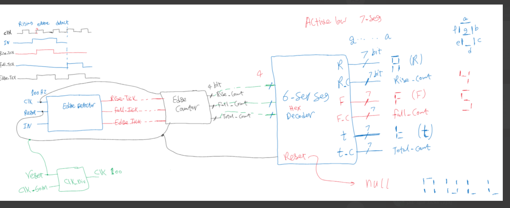
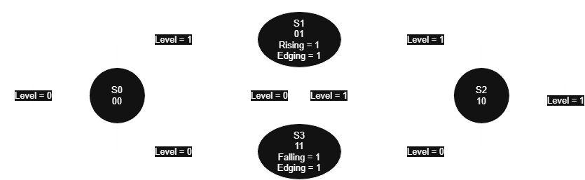
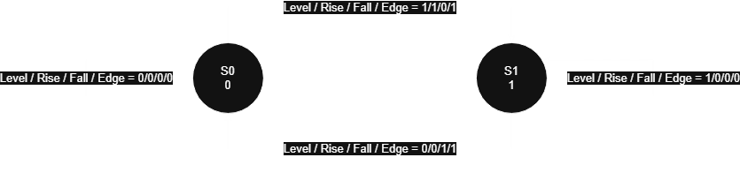

# Edge Detection, Counting & 7-Segment Display System

## Overview

This project implements a digital system that monitors a single input signal, `level`, and detects **rising edges**, **falling edges**, and **any edge (rising or falling)** on that signal. Each detected event is counted, and the three running counts (Rising Count, Falling Count, and Edge Count) are displayed live on six 7-segment displays, along with the labels `R`, `F`, and `t`.

The design is built in Verilog and was developed and verified using digital design coursework practices — RTL design, functional simulation, and FPGA hardware deployment.

Two finite state machine (FSM) styles were implemented for the edge detector as part of the design exercise:
- A **Moore FSM** (`Rising_Falling_Edge_moore.v`) — used in the final, integrated `Top_Module`.
- A **Mealy FSM** (`Rising_Falling_Edge_mealy.v`) — included as an alternative/reference implementation for comparison.

## System Architecture

```
                50 MHz FPGA Clock
                        │
                        ▼
                ┌───────────────┐
                │ Clock Divider │  (Clk_Divider.v)
                └───────────────┘
                        │
                    100 Hz clock
                        │
                        ▼
        ┌───────────────────────────────┐
        │  Rising/Falling Edge Detector  │  (Rising_Falling_Edge_moore.v)
        │         (Moore FSM)            │
        └───────────────────────────────┘
                        │
        Rising_tick / Falling_tick / Edge_tick
                        │
                        ▼
                ┌───────────────┐
                │  Edge Counter  │  (Rising_Falling_Edge_Counter.v)
                └───────────────┘
                        │
        Rising_Count / Falling_Count / Edge_Count (4-bit each)
                        │
                        ▼
        ┌───────────────────────────────┐
        │  Six 7-Segment Display Decoder │  (Six_7seg_decoder.v + Seven_Seg_Decoder.v)
        └───────────────────────────────┘
                        │
                        ▼
                6 × 7-Segment Displays
             [ R | Rise_Count | F | Fall_Count | t | Edge_Count ]
```

A hand-drawn version of this architecture, including the active-low 7-segment segment mapping, is available below:



## Block Descriptions

### 1. Clock Divider — `Clk_Divider.v`

Module: `clk_divider`

- Takes the 50 MHz board clock (`clk`) as input.
- Divides it down to a slower clock, `clk_out`, using a parameterized output frequency (`Output_freq`, default `100` Hz).
- The divide value is computed as `Shift_reg = 50,000,000 / (2 × Output_freq)`, which for the default parameter gives `250,000`.
- An internal counter toggles `clk_out` every time it reaches `Shift_reg - 1`.
- Reset is **active-low** (`rst_n`): while `rst_n` is low, the counter and `clk_out` are held at `0`.

### 2. Rising/Falling/Edge Detector

Two implementations are provided; **the final integrated Top Module uses the Moore FSM version.**

#### Moore FSM — `Rising_Falling_Edge_moore.v` (used in Top_Module)

Module: `rising_falling_edge_moore`

Monitors the `level` input synchronously on the divided clock and produces three registered (Moore-style) outputs: `Rising_tick`, `Falling_tick`, and `Edge_tick`.

States (from the code):

| State | Encoding | Meaning |
|-------|----------|---------|
| `S0`  | `2'b00`  | Waiting for rising edge |
| `S1`  | `2'b01`  | Rising edge detected |
| `S2`  | `2'b10`  | Waiting for falling edge |
| `S3`  | `2'b11`  | Falling edge detected |

State transitions:

- `S0 → S1` if `level = 1`, else stay in `S0`.
- `S1 → S2` if `level = 1`, else `S1 → S3`.
- `S2 → S3` if `level = 0`, else stay in `S2`.
- `S3 → S0` if `level = 0`, else `S3 → S1`.

Outputs are decoded from the **current state** (pure Moore behavior):
- `Rising_tick = 1` when `prev_state == S1`
- `Falling_tick = 1` when `prev_state == S3`
- `Edge_tick = Rising_tick | Falling_tick`



#### Mealy FSM Reference — `Rising_Falling_Edge_mealy.v`

Module: `rising_falling_edge_mealy`

Included as an alternative/reference implementation for comparison. It uses a simpler two-state machine:

| State | Encoding | Meaning |
|-------|----------|---------|
| `S0`  | `2'b0`   | Idle / waiting for rising edge |
| `S1`  | `2'b1`   | Waiting for falling edge |

Here, `Rising_tick`, `Falling_tick`, and `Edge_tick` are combinational (Mealy-style) outputs driven directly by the current state **and** the `level` input, rather than only by the current state.



> The Mealy implementation is functionally equivalent for edge detection purposes but is not instantiated in `Top_Module.v`. It is kept in the project for design comparison and learning purposes, and a separate copy is also kept under `Mealy Code/Rising_Falling_Edge_mealy.v`.

### 3. Edge Counter — `Rising_Falling_Edge_Counter.v`

Module: `rising_falling_edge_counter`

- Takes the three tick outputs from the detector: `R_tick`, `F_tick`, `E_tick`.
- Maintains three independent **4-bit** up-counters: `Rising_Count`, `Falling_Count`, `Edge_Count`.
- On each clock edge, any counter whose corresponding tick is high increments by one.
- Reset is **active-low** (`rst_n`): all three counters are cleared to `0` while `rst_n` is low.
- Being 4-bit, each counter wraps around after reaching `15`.

### 4. Seven Segment Decoder — `Seven_Seg_Decoder.v`

Module: `seven_seg_decoder`

- Converts a 4-bit hexadecimal input (`data_in`, `0`–`F`) into a 7-bit segment pattern (`seg_out`).
- The segment bus is ordered `gfedcba`, where **`g` is the MSB** and **`a` is the LSB**.
- The display is **active-low**: a `0` bit turns the corresponding segment ON.
- All 16 hex digits (`0`–`F`) are supported via a `case` statement; any unlisted input defaults to all segments off (`7'b1111111`).

### 5. Six 7-Segment Decoder — `Six_7seg_decoder.v`

Module: `six_7seg_decoder`

Drives six 7-segment outputs: `R`, `R_C`, `F`, `F_C`, `t`, `t_C`. Internally it instantiates three copies of `seven_seg_decoder` to decode the Rising, Falling, and Edge counts.

**During reset (`rst_n = 0`)**, the displays are forced to spell out "null" (with the last two digits blanked):

| Display | Pattern |
|---------|---------|
| `R`     | `n`   |
| `R_C`   | `u`   |
| `F`     | `L`   |
| `F_C`   | `L`   |
| `t`     | OFF   |
| `t_C`   | OFF   |

**During normal operation (`rst_n = 1`)**, the six displays show:

| Display | Content |
|---------|---------|
| 1st (`R`)   | Letter `R` |
| 2nd (`R_C`) | Rising Count (decoded via `Seven_Seg_Decoder`) |
| 3rd (`F`)   | Letter `F` |
| 4th (`F_C`) | Falling Count (decoded via `Seven_Seg_Decoder`) |
| 5th (`t`)   | Letter `t` |
| 6th (`t_C`) | Edge (Total) Count (decoded via `Seven_Seg_Decoder`) |

### 6. Top Module — `Top_Module.v`

Module: `top_module`

Wires together the full data path:

1. `clk_divider` divides the 50 MHz `clk` down to the 100 Hz internal clock (`clk_100Hz`), gated by `rst_n`.
2. `Rising_Falling_Edge_moore` (the **Moore** detector) runs on `clk_100Hz` and monitors `level`, producing `Rising_tick`, `Falling_tick`, `Edge_tick`.
3. `Rising_Falling_Edge_Counter` accumulates the three ticks into `Rising_Count`, `Falling_Count`, `Edge_Count`.
4. `six_7seg_decoder` converts the three counts (plus reset state) into the six 7-segment outputs `R`, `R_C`, `F`, `F_C`, `t`, `t_C`.

The Mealy detector is **not** instantiated here — the integrated design uses the Moore FSM exclusively.

## Moore FSM

See [Block 2 — Rising/Falling/Edge Detector](#2-risingfallingedge-detector) above for the full state table and transition logic, and the diagram below:


## Mealy FSM Reference

See [Block 2 — Rising/Falling/Edge Detector](#2-risingfallingedge-detector) above. The Mealy version is provided purely as a reference/comparison implementation and is not part of the synthesized top-level design.


## 7-Segment Display Mapping

- Segment bus order: `gfedcba` (`g` = MSB, `a` = LSB).
- Displays are **active-low** (a `0` bit lights the segment).
- The `Seven_Seg_Decoder.v` module supports hexadecimal digits `0`–`F`.
- The six physical displays are arranged as: `R | Rising Count | F | Falling Count | t | Edge Count`.

## Reset Behavior

- Reset (`rst_n`) is **active-low** throughout the design (clock divider, edge detector FSMs, edge counter, and display decoder).
- While `rst_n = 0`:
  - The clock divider holds its counter and `clk_out` at `0`.
  - Both FSMs are held in their initial state (`S0`).
  - All three counters (`Rising_Count`, `Falling_Count`, `Edge_Count`) are cleared to `0`.
  - The six displays show "null" (`n u L L` with the last two digits off), as implemented in `Six_7seg_decoder.v`.
- Once `rst_n = 1`, the system begins normal operation: counting edges and displaying live counts.

## Verification / Testbench

`Top_TestBench.v` is the verification file used to exercise the complete top-level (`top_module`) design. It:

- Instantiates `top_module` as the DUT.
- Generates a 50 MHz clock (`#10` half-period) for `clk`.
- Uses `$monitor` to continuously print `clk`, `rst_n`, `level`, and all six display outputs (`R`, `R_C`, `F`, `F_C`, `t`, `t_C`) whenever any of them change.
- Applies a manual sequence of stimulus, synchronized to the DUT's internal `clk_100Hz`:
  1. Holds `rst_n = 0` with `level = 0`.
  2. Releases reset (`rst_n = 1`).
  3. Drives `level = 1` (rising edge) and waits a couple of `clk_100Hz` cycles.
  4. Drives `level = 0` (falling edge).
  5. Drives `level = 1` again (second rising edge).
  6. Drives `level = 0` again (second falling edge).
  7. Ends the simulation with `$finish`.

This is a directed, waveform/monitor-based testbench — it applies reset and level transitions and observes the resulting outputs; it does not include self-checking assertions.

## Simulation Results

The design was simulated (Questa/ModelSim) using `Top_TestBench.v`. The simulation transcript confirms clean compilation and elaboration with no errors or warnings:

```
Errors: 0, Warnings: 0
```

The resulting waveform, showing `level` transitions alongside the detector ticks, counts, and 7-segment outputs, is shown below:


## FPGA Hardware Results

The design was also deployed and tested on an FPGA development board. Screenshots captured from the board during hardware testing are included in the `FPGA_Dev_Board_Results/` folder:


## Project Structure

```
Edge Detection, Counting & 7-Segment Display System/
├── Clk_Divider.v
├── Rising_Falling_Edge_Counter.v
├── Rising_Falling_Edge_mealy.v
├── Rising_Falling_Edge_moore.v
├── Seven_Seg_Decoder.v
├── Six_7seg_decoder.v
├── Top_Module.v
├── Top_TestBench.v
├── Moore_State_Diagram.png
├── Mealy_State_Diagram.png
├── Design.png
├── WaveForm.png
├── transcript
├── Mealy Code/
│   └── Rising_Falling_Edge_mealy.v
└── FPGA_Dev_Board_Results/
    └── (hardware test screenshots)
```

## Tools Used

- **Verilog HDL** for RTL design.
- **Questa/ModelSim** for functional simulation (transcript, `wave.do`, and waveform export).
- **FPGA development board** for hardware deployment and testing.

## Conclusion

This project demonstrates a complete digital design flow for an edge-detection and counting system: a parameterized clock divider, two alternative FSM styles (Moore and Mealy) for edge detection, a 4-bit multi-signal edge counter, and a hex-to-seven-segment display pipeline driving six active-low displays. The Moore FSM implementation was chosen for the final integrated `Top_Module`, with the Mealy version retained as a reference design. The system was verified through directed simulation (0 errors, 0 warnings) and further validated on FPGA hardware.
```
