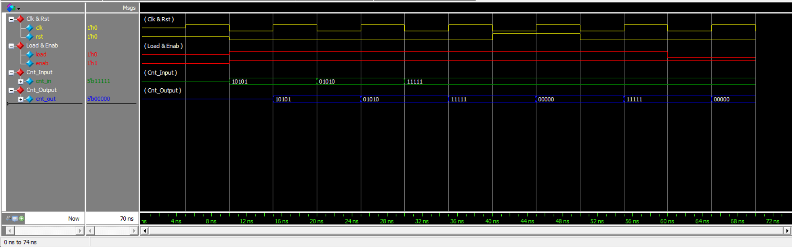

# Generic Counter (Verilog)

A parameterized up-counter implemented in **two different RTL styles** in Verilog HDL, verified with a single self-checking testbench and simulated in Questa/ModelSim.

---

## 1. Overview

This project implements a parameterized **Generic Counter** with synchronous load, enable, and reset. The default width is `WIDTH = 5`. The core behavior is implemented twice — once with a separate combinational block and once with a function — to demonstrate two equivalent ways of modeling the same next-state logic.

| Signal | Direction | Width | Description |
|---|---|---|---|
| `clk` | input | 1 | Clock. All updates occur on the positive edge. |
| `rst` | input | 1 | Synchronous reset (highest priority). |
| `load` | input | 1 | Load enable. |
| `enab` | input | 1 | Count enable. |
| `cnt_in` | input | `WIDTH` | Value loaded into the counter when `load = 1`. |
| `cnt_out` | output | `WIDTH` | Current counter value. |

---

## 2. Objective

- Implement a parameterized, priority-controlled counter.
- Model the same combinational behavior in two different ways: a dedicated `always @(*)` block and a Verilog `function`.
- Verify both implementations with the same self-checking testbench.
- Confirm that both RTL styles produce identical simulation results.

---

## 3. Counter Functionality

On every positive edge of `clk`, `cnt_out` is updated according to a fixed priority:

**RST → LOAD → ENABLE → HOLD**

1. **`rst = 1`** → `cnt_out` is cleared to zero.
2. **`rst = 0`, `load = 1`** → `cnt_out` loads `cnt_in`.
3. **`rst = 0`, `load = 0`, `enab = 1`** → `cnt_out` increments by one.
4. **`rst = 0`, `load = 0`, `enab = 0`** → `cnt_out` holds its previous value.

---

## 4. Design Architecture

```
                    +----------------+
rst --------------->|                |
load -------------->|                |
enab -------------->|   Next-State   |----> cnt_next
cnt_in ------------>|     Logic      |
cnt_out ----------->|                |
                    +----------------+
                             |
                             v
                         +-------+
clk -------------------->| Reg.  |
                         +---+---+
                             |
                             v
                          cnt_out
```

`counter.v` realizes the next-state logic block with a separate `always @(*)` block. `counter2.v` realizes the exact same logic inside the `counter_next()` function. In both cases, the resulting next value is registered into `cnt_out` on the rising edge of `clk`.

---

## 5. Implementation 1 — `counter.v`

This version splits the design into two blocks connected by an intermediate signal, `cnt_next`:

- A **combinational block** (`always @(*)`) computes `cnt_next` from `rst`, `load`, `enab`, `cnt_in`, and the current `cnt_out`.
- A **sequential block** (`always @(posedge clk)`) registers `cnt_next` into `cnt_out` on the rising clock edge.

```verilog
//==================================================
// Combinational Logic
//==================================================
always @(*) begin

    if (rst)
        cnt_next = {WIDTH{1'b0}};

    else if (load)
        cnt_next = cnt_in;

    else if (enab)
        cnt_next = cnt_out + 1'b1;

    else
        cnt_next = cnt_out;

end

//==================================================
// Sequential Logic
//==================================================
always @(posedge clk) begin
    cnt_out <= cnt_next;
end
```

---

## 6. Implementation 2 — `counter2.v`

This version implements the **same behavior** using a Verilog function, `counter_next()`, which encapsulates the combinational priority logic and returns the next counter value. The sequential block calls this function directly on the positive clock edge instead of reading an intermediate signal.

```verilog
//==================================================
// Sequential Logic
//==================================================
always @(posedge clk) begin
    cnt_out <= counter_next(
        rst,
        load,
        enab,
        cnt_in,
        cnt_out
    );
end
```

---

## 7. Function-Based Modeling

`counter2.v` applies the concept:

> **Encapsulate counter design combinational behaviors in a function.**

The function performs the exact same priority operations as the combinational block in `counter.v` — `rst → zero`, `load → cnt_in`, `enab → cnt_out + 1`, otherwise `hold` — but packages them as a reusable, self-contained unit that returns a value rather than writing to an intermediate `reg`:

```verilog
function [WIDTH-1:0] counter_next;
    input             rst;
    input             load;
    input             enab;
    input [WIDTH-1:0] cnt_in;
    input [WIDTH-1:0] cnt_out;

    begin
        if (rst)
            counter_next = {WIDTH{1'b0}};

        else if (load)
            counter_next = cnt_in;

        else if (enab)
            counter_next = cnt_out + 1'b1;

        else
            counter_next = cnt_out;
    end
endfunction
```

---

## 8. Comparison of Both Implementations

`counter.v` and `counter2.v` are **two implementations of the same functionality** — not two different counters or two different specifications. They exist to demonstrate two ways of modeling the same combinational behavior: a separate `always @(*)` block versus a function call.

| Feature | counter.v | counter2.v |
|---------|-----------|------------|
| Parameterized Width | Yes | Yes |
| Synchronous Operation | Yes | Yes |
| Reset | Yes | Yes |
| Load | Yes | Yes |
| Enable | Yes | Yes |
| Hold | Yes | Yes |
| Combinational Modeling | `always @(*)` | Function |
| Sequential Modeling | `always @(posedge clk)` | `always @(posedge clk)` |
| Functional Result | Same | Same |

Both implementations were verified using the same testbench and produced the same simulation results.

---

## 9. Verification

`counter_test.v` instantiates the counter with `WIDTH = 5` and performs self-checking verification using a reusable task:

```verilog
task expect;
  input [WIDTH-1:0] exp_out;
  if (cnt_out !== exp_out) begin
    $display("TEST FAILED");
    $display("At time %0d rst=%b load=%b enab=%b cnt_in=%b cnt_out=%b",
              $time, rst, load, enab, cnt_in, cnt_out);
    $display("cnt_out should be %b", exp_out);
    $finish;
  end
  else begin
    $display("At time %0d rst=%b load=%b enab=%b cnt_in=%b cnt_out=%b",
              $time, rst, load, enab, cnt_in, cnt_out);
  end
endtask
```

The `expect` task compares the actual `cnt_out` against the expected value using `!==` and reports `TEST FAILED` if they do not match, otherwise it logs the current signal values and the test continues.

**Test cases exercised by the testbench:**

1. Load `10101` → Expected `10101` — Actual `10101`
2. Load `01010` → Expected `01010` — Actual `01010`
3. Load `11111` → Expected `11111` — Actual `11111`
4. Assert reset (`rst = 1`) → Expected `00000` — Actual `00000`
5. Load `11111` again → Expected `11111` — Actual `11111`
6. Disable load, enable counting (`rst=0, load=0, enab=1`) → Expected `00000` — Actual `00000`

All test cases passed successfully.

The same testbench (`counter_test.v`) was used to verify the counter behavior, and both RTL implementations produced the same functional results.

**Result: TEST PASSED — Errors: 0, Warnings: 0**

---

## 10. Simulation Results

| Time | rst | load | enab | cnt_in | cnt_out |
|------|-----|------|------|--------|---------|
| 20 ns | 0 | 1 | 1 | 10101 | 10101 |
| 30 ns | 0 | 1 | 1 | 01010 | 01010 |
| 40 ns | 0 | 1 | 1 | 11111 | 11111 |
| 50 ns | 1 | 1 | 1 | 11111 | 00000 |
| 60 ns | 0 | 1 | 1 | 11111 | 11111 |
| 70 ns | 0 | 0 | 1 | 11111 | 00000 |

Both implementations produced the same expected results, recorded as `Results/transcript1` and `Results/transcript2`, each ending with:

```
TEST PASSED
Errors: 0, Warnings: 0
```

---

## 11. Waveform



The waveform demonstrates the clock, reset, load, enable, input count value (`cnt_in`), and the resulting counter output (`cnt_out`) throughout the simulation, showing the load, reset, and increment behavior described above.

---

## 12. Project Files

| File | Description |
|---|---|
| `counter.v` | Generic counter using separate combinational and sequential logic. |
| `counter2.v` | Alternative implementation using the `counter_next()` function. |
| `counter_test.v` | Self-checking testbench containing the `expect` task. |
| `Results/WaveForm.png` | Simulation waveform. |
| `Results/transcript1` | Simulation transcript/results. |
| `Results/transcript2` | Simulation transcript/results. |
| `Results/w.c` | Simulation-generated support file. |

---

## 13. Tools Used

- Verilog HDL
- Questa/ModelSim

---

## 14. Conclusion

This project demonstrates:

- **Parameterized counter design** using a `WIDTH` parameter.
- **Synchronous sequential logic**, with all state updates occurring on the positive edge of `clk`.
- **Priority-based control** following the order RST → LOAD → ENABLE → HOLD.
- **Separate combinational/sequential RTL modeling** in `counter.v`.
- **Function-based combinational modeling** in `counter2.v`, encapsulating the next-state logic in `counter_next()`.
- **Reusable task-based testbench verification** using a self-checking `expect` task.
- **Two different RTL implementations producing the same functional result**, confirmed by identical `TEST PASSED` outcomes across both simulation runs.
```
