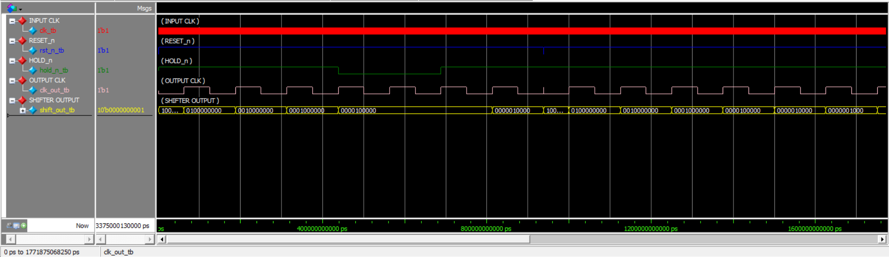
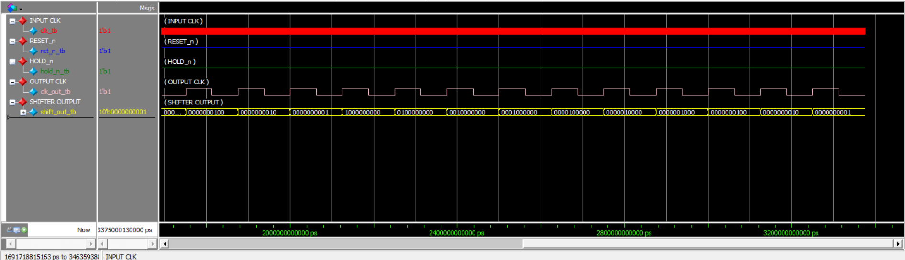
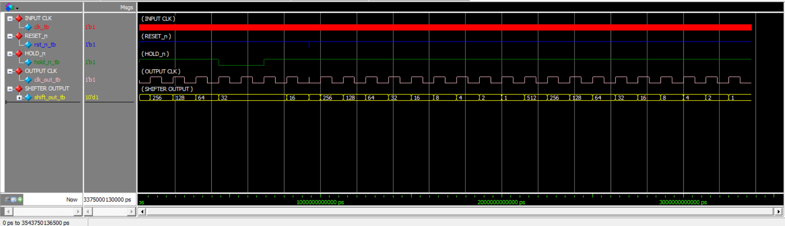

# Light Chaser with Clock Divider

## Overview

This project implements a parameterized **Light Chaser** circuit driven by a configurable clock divider.

The design consists of two main modules:

- **Clock Divider** – Divides the fixed 50 MHz input clock to generate a lower-frequency output clock.
- **Light Chaser** – Uses the divided clock to shift a single logic `1` across a 10-bit output.

The complete design flow is:

```text
50 MHz Input Clock
        │
        ▼
┌──────────────────┐
│   Clock Divider  │
│   Output = 8 Hz  │
└──────────────────┘
        │
        ▼
   Divided Clock
        │
        ▼
┌──────────────────┐
│   Light Chaser   │
│    10-bit Shift  │
└──────────────────┘
        │
        ▼
  10-bit Light Output
```

The testbench verifies:

- Normal shifting
- Hold functionality
- Hold release
- Reset functionality
- Continuous light-chasing sequence

---

## Design Architecture

The system contains a clock divider followed by a 10-bit light chaser.

```text
                  50 MHz Clock
                       │
                       ▼
              ┌─────────────────┐
              │  Clock Divider  │
              │                 │
              │  50 MHz → 8 Hz  │
              └─────────────────┘
                       │
                       │ clk_out
                       ▼
              ┌─────────────────┐
              │  Light Chaser   │
              │                 │
              │    10-bit       │
              │  Shift Register │
              └─────────────────┘
                       │
                       ▼
                 shift_out[9:0]
```

---

# 1. Clock Divider

## 1.1 Description

The `clk_divider` module generates a lower-frequency clock from a fixed **50 MHz input clock**.

The output frequency is parameterized using `Output_freq`.

For an output frequency of **8 Hz**, the required counter value is:

```text
Counter Value = 50,000,000 / (2 × Output_freq)
```

Therefore:

```text
Counter Value = 50,000,000 / (2 × 8)
              = 3,125,000
```

The output clock toggles whenever the counter reaches the terminal count.

This produces an approximately **8 Hz output clock**.

## 1.2 Module

[`Clk_divider.v`](Clk_divider.v)

```verilog
module clk_divider #(
    parameter Output_freq = 8
)(
    input  wire clk,
    input  wire rst_n,
    output reg  clk_out
);

    /*
        Input Clock  = 50 MHz

        Counter value: 50,000,000 / (2 × Output_freq)

        Shift_reg: 

        For Output_freq = 8 Hz:
        50,000,000 / (2 × 8) = 3,125,000
    */

    parameter Shift_reg = 50_000_000 / (2 * Output_freq);

    reg [$clog2(Shift_reg)-1:0] counter;

    always @(posedge clk or negedge rst_n) begin

        if (!rst_n) begin
            counter <= 'd0;
            clk_out <= 1'b0;
        end

        else if (counter == Shift_reg - 1) begin
            counter <= 'd0;
            clk_out <= ~clk_out;
        end

        else begin
            counter <= counter + 1'b1;
        end

    end

endmodule
```

---

# 2. Light Chaser

## 2.1 Description

The `light_chaser` module implements a parameterized **10-bit shifting light pattern**.

The design starts with the MSB set to `1`:

```text
1000000000
```

On every rising edge of the divided clock, the `1` shifts one position to the right.

The sequence is:

```text
1000000000
0100000000
0010000000
0001000000
0000100000
0000010000
0000001000
0000000100
0000000010
0000000001
1000000000
```

When the `1` reaches the LSB, the pattern returns to the initial state.

## 2.2 Hold Function

The `hold_n` input is **active-low**.

When:

```text
hold_n = 0
```

the current output is held without shifting.

When:

```text
hold_n = 1
```

normal shifting resumes.

## 2.3 Reset

The `rst_n` input is an **active-low asynchronous reset**.

When:

```text
rst_n = 0
```

the output is immediately initialized to:

```text
1000000000
```

## 2.4 Module

[`light_chaser.v`](light_chaser.v)

```verilog
module light_chaser #(
    parameter WIDTH = 10
)(
    input  wire             clk,
    input  wire             rst_n,
    input  wire             hold_n,
    output wire [WIDTH-1:0] shift_out
);

    reg [WIDTH-1:0] shift_reg;

    always @(posedge clk or negedge rst_n) begin

        if (!rst_n) begin
            shift_reg <= {1'b1, {(WIDTH-1){1'b0}}};
        end

        else if (!hold_n) begin
            shift_reg <= shift_reg;
        end

        else begin
            if (shift_reg[0] == 1'b1)
                shift_reg <= {1'b1, {(WIDTH-1){1'b0}}};
            else
                shift_reg <= shift_reg >> 1;
        end

    end

    assign shift_out = shift_reg;

endmodule
```

---

# 3. Testbench

## 3.1 Description

The testbench verifies both the clock divider and the light chaser.

The input clock is generated with a period of **20 ns**, corresponding to:

```text
50 MHz
```

The clock divider is configured for:

```text
Output_freq = 8 Hz
```

The divided clock is then connected directly to the Light Chaser module.

### Testbench Flow

```text
50 MHz Clock
     │
     ▼
Clock Divider
     │
     │ 8 Hz
     ▼
Light Chaser
     │
     ▼
10-bit Shift Output
```

## 3.2 Test Cases

The testbench verifies the following cases:

### 1. Normal Shifting

The light moves through the output bits sequentially.

```text
1000000000
0100000000
0010000000
0001000000
...
```

### 2. Hold Test

When `hold_n = 0`, the current output remains unchanged.

Example:

```text
0000100000
0000100000
```

### 3. Hold Release

When `hold_n` returns to `1`, normal shifting continues.

Example:

```text
0000100000
0000010000
```

### 4. Reset Test

When `rst_n = 0`, the output returns immediately to:

```text
1000000000
```

### 5. Continuous Shifting

After reset is released, the testbench allows the light chaser to continue for 20 output clock cycles.

## 3.3 Testbench Module

[`TestBench.v`](TestBench.v)

```verilog
`timescale 1ns/1ps

module tb_light_chaser;

    reg clk_tb;
    reg rst_n_tb;
    reg hold_n_tb;

    wire clk_out_tb;
    wire [9:0] shift_out_tb;

    //========================================================
    // Clock Divider
    //========================================================
    clk_divider #(
        .Output_freq(8)
    ) DUT_DIV (
        .clk(clk_tb),
        .rst_n(rst_n_tb),
        .clk_out(clk_out_tb)
    );

    //========================================================
    // Light Chaser
    //========================================================
    light_chaser #(
        .WIDTH(10)
    ) DUT_CHASER (
        .clk(clk_out_tb),
        .rst_n(rst_n_tb),
        .hold_n(hold_n_tb),
        .shift_out(shift_out_tb)
    );

    //========================================================
    // 50 MHz Clock
    // Period = 20 ns
    //========================================================
    always #10 clk_tb = ~clk_tb;

    //========================================================
    // Display Light Chaser Output
    //========================================================
    always @(posedge clk_out_tb) begin
        #1;
        $display("Time=%t | rst_n=%b | hold_n=%b | shift_out=%b",
                 $time, rst_n_tb, hold_n_tb, shift_out_tb);
    end

    //========================================================
    // Test
    //========================================================
    initial begin

        // Clear values
        clk_tb    = 1'b0;
        rst_n_tb  = 1'b0;
        hold_n_tb = 1'b1;

        #100;

        // Release reset and start the shifter
        rst_n_tb = 1'b1;

        //====================================================
        // Normal Shifting
        //====================================================
        repeat (4) @(posedge clk_out_tb);

        //====================================================
        // Hold Test
        //====================================================
        hold_n_tb = 1'b0;

        repeat (2) @(posedge clk_out_tb);

        //====================================================
        // Release Hold
        //====================================================
        hold_n_tb = 1'b1;

        repeat (2) @(posedge clk_out_tb);

        //====================================================
        // Reset Test
        //====================================================
        rst_n_tb = 1'b0;

        // Wait using input clock because clk_out is held at 0
        repeat (2) @(posedge clk_tb);

        $display("Time=%t | rst_n=%b | hold_n=%b | shift_out=%b",
                 $time, rst_n_tb, hold_n_tb, shift_out_tb);

        //====================================================
        // Release Reset
        //====================================================
        rst_n_tb = 1'b1;

        //====================================================
        // Continue Shifting
        // 20 output clock cycles
        //====================================================
        repeat (20) @(posedge clk_out_tb);

        $display("==============================================================");
        $display("              All Tests Completed Successfully!              ");
        $display("==============================================================");

        $finish;

    end

endmodule
```

---

# 4. Simulation Results

The design was simulated using **Questa Sim 2024.1**.

The simulation completed successfully with:

```text
Errors   : 0
Warnings : 0
```

## 4.1 Normal Shifting

The normal shifting sequence was verified:

| Step | `shift_out` |
|------|-------------|
| 1 | `0100000000` |
| 2 | `0010000000` |
| 3 | `0001000000` |
| 4 | `0000100000` |
| 5 | `0000010000` |
| 6 | `0000001000` |
| 7 | `0000000100` |
| 8 | `0000000010` |
| 9 | `0000000001` |
| 10 | `1000000000` |

The pattern correctly returns to the initial state after reaching the LSB.

---

## 4.2 Hold Test

When:

```text
hold_n = 0
```

the output remained unchanged:

```text
0000100000
0000100000
```

This confirms that the active-low hold function works correctly.

---

## 4.3 Hold Release

After setting:

```text
hold_n = 1
```

the light chaser resumed normal operation:

```text
0000100000
0000010000
```

---

## 4.4 Reset Test

When the active-low reset was asserted:

```text
rst_n = 0
```

the output returned to:

```text
1000000000
```

The output remained in the reset state until reset was released.

---

## 4.5 Continuous Operation

After reset was released, the light chaser continued shifting through the complete 10-bit sequence.

The simulation successfully completed the requested 20 output clock cycles.

Final simulation message:

```text
==============================================================
              All Tests Completed Successfully!              
==============================================================
```

The simulation ended with:

```text
Errors: 0
Warnings: 0
```

---

# 5. Waveforms

The simulation waveforms show the behavior of the clock divider, reset, hold control, and 10-bit light chaser output.

The main signals observed in the simulation are:

- `clk_tb`
- `rst_n_tb`
- `hold_n_tb`
- `clk_out_tb`
- `shift_out_tb`

## 5.1 Binary Waveform 1



## 5.2 Binary Waveform 2



## 5.3 Decimal Waveform



---

# 6. Simulation Transcript

The complete Questa simulation transcript is available here:

[`transcript`](Results/transcript)

The transcript confirms:

```text
Errors: 0
Warnings: 0
```

and shows the correct light-chaser sequence, hold operation, reset operation, and successful completion of the testbench.

---

# 7. Files

| File | Description |
|------|-------------|
| [`Clk_divider.v`](Clk_divider.v) | Parameterized clock divider for generating the output clock |
| [`light_chaser.v`](light_chaser.v) | Parameterized 10-bit light chaser |
| [`TestBench.v`](TestBench.v) | Verification testbench |
| [`transcript`](Results/transcript) | Questa simulation transcript |
| [`WaveForm_Binary1.png`](Results/WaveForm_Binary1.png) | Binary simulation waveform |
| [`WaveForm_Binary2.png`](Results/WaveForm_Binary2.png) | Binary simulation waveform |
| [`WaveForm_Decimal.png`](Results/WaveForm_Decimal.png) | Decimal simulation waveform |

---

# 8. Tools Used

- **Verilog HDL**
- **Questa Sim 2024.1**
- **GitHub**

---

# Conclusion

The **Light Chaser with Clock Divider** was successfully implemented and verified using Verilog HDL.

The project combines a parameterized clock divider with a parameterized light-chaser module.

The clock divider converts the fixed **50 MHz input clock** to an **8 Hz output clock**, which is then used to control the 10-bit shifting light pattern.

The testbench successfully verified:

- Normal light shifting
- Hold functionality
- Hold release
- Asynchronous reset
- Continuous operation
- Complete light-chaser sequence

The simulation completed successfully with:

```text
Errors   : 0
Warnings : 0
```

Overall, the simulation results confirm the correct operation of the complete:

```text
50 MHz Clock
      ↓
Clock Divider
      ↓
8 Hz Clock
      ↓
10-bit Light Chaser
```

system.
