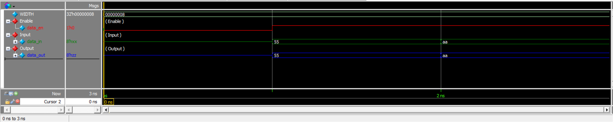

# Modeling a Data Driver

## Overview

This project implements a parameterized **Data Driver** using Verilog HDL.

The Data Driver controls whether an input data value is passed to the output or whether the output is placed in a **high-impedance (`Z`) state**.

The behavior is controlled by the `data_en` enable signal:

- When `data_en = 1`, `data_in` is passed directly to `data_out`.
- When `data_en = 0`, `data_out` becomes high impedance.

The design is parameterized with a default width of **8 bits**.

---

## Design Architecture

The Data Driver can be represented as:

```text
                    8-bit
                     │
                     ▼
                ┌─────────┐
    data_in ───►│         │
                │ Driver  │───► data_out
    data_en ───►│         │
                └─────────┘
                     │
                     ▼
                 Enable
```

The output behavior is:

```text
data_en = 1  →  data_out = data_in

data_en = 0  →  data_out = Z
```

---

# 1. Data Driver Module

## 1.1 Description

The `driver` module is a parameterized-width bus driver.

It receives an input data bus and an enable signal. A continuous assignment is used to control the output based on the enable condition.

The output is:

```text
data_out = data_in       when data_en = 1
data_out = Z             when data_en = 0
```

The high-impedance state allows the output to effectively disconnect from the shared bus when the driver is disabled.

## 1.2 Module

[`driver.v`](driver.v)

```verilog
module driver #(
    parameter WIDTH = 8
) (
    input  wire              data_en,
    input  wire [WIDTH-1:0]  data_in,

    output wire [WIDTH-1:0]  data_out
);
    
    assign data_out = data_en ? data_in : {WIDTH{1'bZ}};

endmodule
```

---

# 2. Parameterization

The driver width is controlled using the `WIDTH` parameter:

```verilog
parameter WIDTH = 8
```

This allows the same module to support different bus widths without changing the internal logic.

For example:

```text
WIDTH = 8   →  8-bit Data Driver
WIDTH = 16  →  16-bit Data Driver
WIDTH = 32  →  32-bit Data Driver
```

The high-impedance value is also parameterized:

```verilog
{WIDTH{1'bZ}}
```

This generates a `Z` value with the same width as the data bus.

---

# 3. High-Impedance Output

A high-impedance state is represented in Verilog using:

```text
Z
```

For an 8-bit bus:

```text
8'bZZZZZZZZ
```

When the driver is disabled:

```text
data_en = 0
```

the output becomes:

```text
data_out = ZZZZZZZZ
```

When the driver is enabled:

```text
data_en = 1
```

the input data is passed directly to the output.

For example:

```text
data_in  = 01010101
data_en  = 1
data_out = 01010101
```

---

# 4. Simulation Results

The design was simulated using **Questa Sim 2024.1**.

The simulation verifies both operating conditions of the Data Driver:

1. Disabled driver → High-impedance output
2. Enabled driver → Input data passed to output

### Simulation Results

| Time | `data_en` | `data_in` | `data_out` | Result |
|------|-----------|-----------|------------|--------|
| 1 ns | 0 | `xxxxxxxx` | `zzzzzzzz` | High impedance |
| 2 ns | 1 | `01010101` | `01010101` | Data passed |
| 3 ns | 1 | `10101010` | `10101010` | Data passed |

The simulation completed successfully with:

```text
Errors   : 0
Warnings : 0
```

The observed results confirm that the driver behaves according to the required specification.

---

# 5. Simulation Transcript

The complete simulation transcript is available here:

[`transcript`](Results/transcript)

The important simulation outputs are:

```text
At time 1 data_en=0 data_in=xxxxxxxx data_out=zzzzzzzz

At time 2 data_en=1 data_in=01010101 data_out=01010101

At time 3 data_en=1 data_in=10101010 data_out=10101010

TEST PASSED
```

These results confirm that:

- The output becomes high impedance when the driver is disabled.
- The input data is correctly transferred when the driver is enabled.
- The driver operates correctly for the tested input values.

---

# 6. Waveform

The simulation waveform shows the relationship between the enable signal, input data, and output data.

The main signals observed are:

- `data_en`
- `data_in`
- `data_out`

### Simulation Waveform



The waveform confirms that:

```text
data_en = 0 → data_out = ZZZZZZZZ

data_en = 1 → data_out = data_in
```

---

# 7. Files

| File | Description |
|------|-------------|
| [`driver.v`](driver.v) | Parameterized Data Driver implementation |
| [`driver_test.v`](driver_test.v) | Provided verification file |
| [`transcript`](Results/transcript) | Questa simulation transcript |
| [`WaveForm.png`](Results/WaveForm.png) | Simulation waveform |

---

# 8. Tools Used

- **Verilog HDL**
- **Questa Sim 2024.1**
- **GitHub**

---

# Conclusion

The **Data Driver** was successfully implemented using Verilog HDL.

The design uses a parameterized bus width with a default value of **8 bits**.

The `data_en` signal controls the driver operation:

```text
data_en = 1 → data_in is passed to data_out

data_en = 0 → data_out is high impedance
```

The simulation results confirm the correct behavior of the design for both enabled and disabled conditions.

The simulation completed successfully with:

```text
Errors   : 0
Warnings : 0
```

Overall, the project demonstrates the use of **parameterized Verilog designs**, **continuous assignments**, and **high-impedance bus behavior** in digital hardware modeling.
