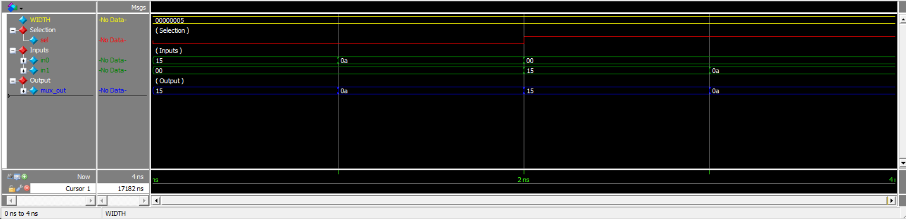

# Modeling an Address Multiplexor

## Overview

This project implements a simple **5-bit Address Multiplexor (MUX)** using Verilog HDL.

The multiplexor selects between two address inputs, `in0` and `in1`, based on the `sel` control signal.

The MUX is parameterized with a default width of **5 bits**.

The complete functionality is:

```text
             ┌─────────────────┐
    in0 ────►│                 │
             │   Multiplexor   │────► mux_out
    in1 ────►│                 │
             │                 │
    sel ────►│                 │
             └─────────────────┘
```

The selection behavior is:

```text
sel = 0  →  mux_out = in0

sel = 1  →  mux_out = in1
```

In the processor architecture, the address multiplexor selects between the instruction address during the instruction fetch phase and the operand address during the instruction execution phase.

---

## Design Specifications

The multiplexor follows the given specifications:

- MUX width is parameterized.
- Default MUX width is **5 bits**.
- When `sel = 1'b0`, `in0` is passed to `mux_out`.
- When `sel = 1'b1`, `in1` is passed to `mux_out`.

### Block Diagram

```text
                    5
              ┌───────────┐
     in0 ─────►           │
                    MUX   ├──────► mux_out
     in1 ─────►           │
              └───────────┘
                    ▲
                    │
                   sel
```

---

# 1. Multiplexor Module

## 1.1 Description

The `multiplexor` module implements a parameterized 2-to-1 multiplexor.

The width of the input and output buses is controlled by the `WIDTH` parameter:

```verilog
parameter WIDTH = 5
```

A conditional operator is used to select the appropriate input:

```text
sel = 0 → in0
sel = 1 → in1
```

## 1.2 Module

[`multiplexor.v`](multiplexor.v)

```verilog
module multiplexor #(
    parameter WIDTH = 5
) (
    input  [WIDTH-1:0] in0,
    input  [WIDTH-1:0] in1,
    input              sel,

    output [WIDTH-1:0] mux_out
);
    
    assign mux_out = sel ? in1 : in0;

endmodule
```

---

# 2. Parameterization

The MUX width is parameterized using:

```verilog
parameter WIDTH = 5
```

This allows the same module to be used with different address widths.

For example:

```text
WIDTH = 5   →   5-bit Multiplexor
WIDTH = 8   →   8-bit Multiplexor
WIDTH = 16  →   16-bit Multiplexor
WIDTH = 32  →   32-bit Multiplexor
```

The default configuration used in this project is:

```text
WIDTH = 5
```

Therefore:

```text
in0     = 5-bit
in1     = 5-bit
mux_out = 5-bit
```

---

# 3. Multiplexor Operation

The MUX operation can be represented by the following truth table:

| `sel` | `mux_out` |
|-------|-----------|
| `0` | `in0` |
| `1` | `in1` |

The corresponding Verilog expression is:

```verilog
assign mux_out = sel ? in1 : in0;
```

This means:

- If `sel` is `1`, `in1` is selected.
- If `sel` is `0`, `in0` is selected.

---

# 4. Simulation Results

The design was simulated using **Questa Sim 2024.1**.

The supplied verification environment tested both possible values of the select signal with different input values.

### Test Case 1

```text
sel     = 0
in0     = 10101
in1     = 00000
mux_out = 10101
```

Since `sel = 0`, the output correctly follows `in0`.

### Test Case 2

```text
sel     = 0
in0     = 01010
in1     = 00000
mux_out = 01010
```

Again, the output correctly follows `in0`.

### Test Case 3

```text
sel     = 1
in0     = 00000
in1     = 10101
mux_out = 10101
```

Since `sel = 1`, the output correctly follows `in1`.

### Test Case 4

```text
sel     = 1
in0     = 00000
in1     = 01010
mux_out = 01010
```

The output correctly follows `in1`.

---

## Simulation Output

The simulation produced the following results:

```text
At time 1 sel=0 in0=10101 in1=00000, mux_out=10101
At time 2 sel=0 in0=01010 in1=00000, mux_out=01010
At time 3 sel=1 in0=00000 in1=10101, mux_out=10101
At time 4 sel=1 in0=00000 in1=01010, mux_out=01010
TEST PASSED
```

The simulation completed successfully with:

```text
Errors   : 0
Warnings : 0
```

---

# 5. Waveform

The simulation waveform shows the relationship between:

- `sel`
- `in0`
- `in1`
- `mux_out`

The waveform confirms that the output changes according to the select signal.

### Simulation Waveform



When:

```text
sel = 0
```

the waveform shows:

```text
mux_out = in0
```

When:

```text
sel = 1
```

the waveform shows:

```text
mux_out = in1
```

---

# 6. Simulation Transcript

The complete Questa simulation transcript is available here:

[`transcript`](Results/transcript)

The transcript confirms that all tested MUX conditions produced the expected output.

The final verification message was:

```text
TEST PASSED
```

---

# 7. Files

| File | Description |
|------|-------------|
| [`multiplexor.v`](multiplexor.v) | Parameterized 2-to-1 address multiplexor |
| [`multiplexor_test.v`](multiplexor_test.v) | Provided verification file |
| [`transcript`](Results/transcript) | Questa simulation transcript |
| [`WaveForm.png`](Results/WaveForm.png) | Simulation waveform |

---

# 8. Tools Used

- **Verilog HDL**
- **Questa Sim 2024.1**
- **GitHub**

---

# Conclusion

The **Address Multiplexor** was successfully implemented using Verilog HDL.

The design uses a parameterized width with a default value of **5 bits** and selects between two input addresses based on the `sel` control signal.

The implemented behavior is:

```text
sel = 0 → mux_out = in0

sel = 1 → mux_out = in1
```

The simulation verified both selection conditions with different input values.

The simulation completed successfully with:

```text
Errors   : 0
Warnings : 0
```

The results confirm the correct operation of the parameterized Address Multiplexor.
