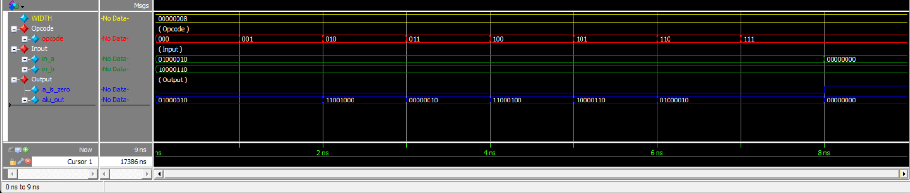

# Modeling the Arithmetic Logic Unit

## Overview

This project implements a parameterized **Arithmetic Logic Unit (ALU)** using Verilog HDL.

The ALU supports multiple operations selected through a 3-bit `opcode` input. The design also provides an `a_is_zero` status output that indicates whether the first input `in_a` is equal to zero.

The ALU has a default data width of **8 bits** and supports the following operations:

- Pass `in_a`
- Pass `in_a`
- Addition
- Bitwise AND
- Bitwise XOR
- Pass `in_b`
- Pass `in_a`
- Pass `in_a`

The complete design can be represented as:

```text
                 ┌──────────────────┐
      in_a ─────►│                  │
                 │                  │
      in_b ─────►│       ALU        │──────► alu_out
                 │                  │
     opcode ────►│                  │
                 │                  │
                 └──────────────────┘
                         │
                         ▼
                    a_is_zero
```

---

## Design Architecture

The ALU receives two data inputs and a 3-bit operation code.

```text
        in_a [7:0] ───────┐
                          │
                          ▼
                    ┌───────────┐
        in_b [7:0] ─►│           │
                    │    ALU    │──────► alu_out [7:0]
     opcode [2:0] ─►│           │
                    └───────────┘
                          │
                          ▼
                     a_is_zero
```

The operation is selected according to the `opcode` value.

---

# 1. ALU Module

## 1.1 Description

The `alu` module is a parameterized combinational ALU.

The data width is controlled by the `WIDTH` parameter:

```verilog
parameter WIDTH = 8
```

The module contains:

### Inputs

- `in_a` – First data input
- `in_b` – Second data input
- `opcode` – 3-bit operation selector

### Outputs

- `alu_out` – ALU result
- `a_is_zero` – Indicates whether `in_a` is zero

## 1.2 Module

[`alu.v`](alu.v)

```verilog
module alu #(
    parameter WIDTH=8 
) (
    input  wire [WIDTH-1:0] in_a    ,
    input  wire [WIDTH-1:0] in_b    ,
    input  wire [2:0]       opcode  ,

    output wire [WIDTH-1:0] alu_out ,
    output wire             a_is_zero
);
    
    assign a_is_zero = (in_a == {WIDTH{1'b0}});
    
    assign alu_out = (opcode==3'b000) ? in_a :
                     (opcode==3'b001) ? in_a :
                     (opcode==3'b010) ? (in_a + in_b) :
                     (opcode==3'b011) ? (in_a & in_b) :
                     (opcode==3'b100) ? (in_a ^ in_b) :
                     (opcode==3'b101) ? in_b :
                     (opcode==3'b110) ? in_a :
                                        in_a ;

endmodule
```

---

# 2. ALU Operations

The ALU uses the 3-bit `opcode` signal to select the required operation.

| Opcode | Operation | Description |
|--------|-----------|-------------|
| `000` | PASS0 | Pass `in_a` |
| `001` | PASS1 | Pass `in_a` |
| `010` | ADD | `in_a + in_b` |
| `011` | AND | `in_a & in_b` |
| `100` | XOR | `in_a ^ in_b` |
| `101` | PASSB | Pass `in_b` |
| `110` | PASS6 | Pass `in_a` |
| `111` | PASS7 | Pass `in_a` |

The ALU is implemented using nested conditional operators.

---

# 3. Zero Detection

The module also generates the `a_is_zero` output.

The zero detection logic is:

```verilog
assign a_is_zero = (in_a == {WIDTH{1'b0}});
```

Therefore:

```text
in_a = 00000000 → a_is_zero = 1

in_a ≠ 00000000 → a_is_zero = 0
```

For example:

```text
in_a = 01000010
a_is_zero = 0
```

While:

```text
in_a = 00000000
a_is_zero = 1
```

---

# 4. Simulation Results

The design was simulated using **Questa Sim 2024.1**.

The simulation tested all eight opcode values using:

```text
in_a = 01000010
in_b = 10000110
```

The following results were obtained:

| Time | Opcode | `in_a` | `in_b` | `a_is_zero` | `alu_out` |
|------|--------|--------|--------|-------------|-----------|
| 1 ns | `000` | `01000010` | `10000110` | `0` | `01000010` |
| 2 ns | `001` | `01000010` | `10000110` | `0` | `01000010` |
| 3 ns | `010` | `01000010` | `10000110` | `0` | `11001000` |
| 4 ns | `011` | `01000010` | `10000110` | `0` | `00000010` |
| 5 ns | `100` | `01000010` | `10000110` | `0` | `11000100` |
| 6 ns | `101` | `01000010` | `10000110` | `0` | `10000110` |
| 7 ns | `110` | `01000010` | `10000110` | `0` | `01000010` |
| 8 ns | `111` | `01000010` | `10000110` | `0` | `01000010` |

The zero-detection functionality was also verified:

| Time | Opcode | `in_a` | `a_is_zero` | `alu_out` |
|------|--------|--------|-------------|-----------|
| 9 ns | `111` | `00000000` | `1` | `00000000` |

---

## Simulation Status

The simulation completed successfully with:

```text
Errors   : 0
Warnings : 0
```

The final verification message was:

```text
TEST PASSED
```

The simulation finished at:

```text
Time: 9 ns
```

---

# 5. Verification Summary

The simulation verified the following operations:

### PASS0

```text
opcode = 000
01000010 → 01000010
```

### PASS1

```text
opcode = 001
01000010 → 01000010
```

### ADD

```text
01000010 + 10000110
= 11001000
```

### AND

```text
01000010 & 10000110
= 00000010
```

### XOR

```text
01000010 ^ 10000110
= 11000100
```

### PASSB

```text
opcode = 101
10000110 → 10000110
```

### PASS6

```text
opcode = 110
01000010 → 01000010
```

### PASS7

```text
opcode = 111
01000010 → 01000010
```

### Zero Detection

```text
in_a = 00000000

a_is_zero = 1
alu_out   = 00000000
```

All tested operations produced the expected outputs.

---

# 6. Waveform

The simulation waveform contains the main ALU signals:

- `opcode`
- `in_a`
- `in_b`
- `a_is_zero`
- `alu_out`

The waveform demonstrates the change in `alu_out` according to the selected opcode.

### Simulation Waveform



The waveform confirms that the ALU correctly performs the selected operation and that the `a_is_zero` signal correctly detects a zero value on `in_a`.

---

# 7. Simulation Transcript

The complete Questa simulation transcript is available here:

[`transcript`](Results/transcript)

The transcript confirms that all tested operations passed successfully.

The final verification result was:

```text
TEST PASSED
```

Simulation status:

```text
Errors   : 0
Warnings : 0
```

---

# 8. Files

| File | Description |
|------|-------------|
| [`alu.v`](alu.v) | Parameterized ALU implementation |
| [`alu_test.v`](alu_test.v) | Provided verification file |
| [`transcript`](Results/transcript) | Questa simulation transcript |
| [`WaveForm.png`](Results/WaveForm.png) | Simulation waveform |

---

# 9. Tools Used

- **Verilog HDL**
- **Questa Sim 2024.1**
- **GitHub**

---

# Conclusion

The **Arithmetic Logic Unit (ALU)** was successfully implemented using Verilog HDL.

The design is parameterized with a default width of **8 bits** and uses a 3-bit opcode to select between eight different operations.

The implemented operations include:

```text
PASS0
PASS1
ADD
AND
XOR
PASSB
PASS6
PASS7
```

The design also includes an `a_is_zero` status signal for detecting when the first input is zero.

The simulation successfully verified all eight opcode values and the zero-detection functionality.

The simulation completed with:

```text
Errors   : 0
Warnings : 0
```

and the final verification result was:

```text
TEST PASSED
```

Overall, the results confirm the correct operation of the parameterized Arithmetic Logic Unit.
