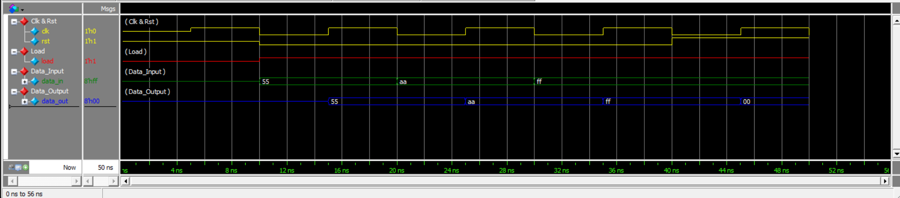

# Generic Register (Verilog)

A parameterized generic register implemented in Verilog HDL, verified with a self-checking testbench and simulated in Questa/ModelSim.

---

## Overview

This project implements a **generic register**: a synchronous storage element whose data width is set by a parameter instead of being hard-coded. The default width is `WIDTH = 8`.

| Signal | Direction | Width | Description |
|---|---|---|---|
| `clk` | input | 1 | Clock. All updates happen on the positive edge. |
| `rst` | input | 1 | Synchronous, active-high reset. Clears the stored value. |
| `load` | input | 1 | Load enable. When high, `data_in` is captured. |
| `data_in` | input | `WIDTH` | Data to be stored. |
| `data_out` | output | `WIDTH` | Currently stored value. |

### Architecture

```
             +------------------+
data_in ---->|                  |
load ------->|  Generic         |----> data_out
rst -------->|  Register        |
clk -------->|                  |
             +------------------+
```

---

## Functional Behavior

The register is updated only on the rising edge of `clk`, using the following priority:

1. **`rst = 1`** → `data_out` is cleared to zero (synchronous reset).
2. **`rst = 0`, `load = 1`** → `data_in` is captured into `data_out`.
3. **`rst = 0`, `load = 0`** → the register holds its previous value.

Because the reset is written inside the clocked block and not in the sensitivity list, it takes effect only at the next clock edge — a **synchronous, active-high** reset.

### RTL

```verilog
module register #(
    parameter WIDTH = 8
)(
    input  wire             clk,
    input  wire             rst,
    input  wire             load,
    input  wire [WIDTH-1:0] data_in,
    output reg  [WIDTH-1:0] data_out
);

    always @(posedge clk) begin

        if (rst)
            data_out <= {WIDTH{1'b0}};

        else if (load)
            data_out <= data_in;

    end

endmodule
```

### Why `{WIDTH{1'b0}}` Makes the Design Generic

The reset value is written as a replication of `1'b0` repeated `WIDTH` times:

```verilog
data_out <= {WIDTH{1'b0}};
```

The constant therefore **scales automatically with the parameter**. Instantiating the module with `WIDTH = 4`, `WIDTH = 16` or `WIDTH = 32` produces a correctly sized zero vector with no change to the RTL. A hard-coded literal such as `8'h00` would silently break width consistency for any other parameter value, so the replication form is what makes this a truly reusable, width-independent register.

---

## Verification

The provided testbench `register_test.v` instantiates the register with `WIDTH = 8` and performs **self-checking** verification.

### The `expect` Task

The testbench defines a reusable task:

```verilog
task expect;
  input [WIDTH-1:0] exp_out;
  ...
endtask
```

The task compares the actual `data_out` against the expected value passed as an argument. If they differ, it prints `TEST FAILED` together with the simulation time and the current values of `rst`, `load`, `data_in` and `data_out`, then terminates the simulation with `$finish`. If they match, it logs the signal values and the test continues.

This keeps each check to a single line in the stimulus sequence and removes repeated comparison code.

### Stimulus Sequence

Stimulus is driven on the negative edge of the clock and checked after the following negative edge, so every check observes the value captured at the intervening positive clock edge:

1. `load = 1`, `data_in = 8'h55` → `expect(8'h55)`
2. `load = 1`, `data_in = 8'hAA` → `expect(8'hAA)`
3. `load = 1`, `data_in = 8'hFF` → `expect(8'hFF)`
4. `rst = 1`, `load = 1`, `data_in = 8'hFF` → `expect(8'h00)`

Test 4 also confirms reset priority: `rst` overrides `load` even though `load` is still asserted.

If all checks pass, the testbench prints `TEST PASSED` and calls `$finish`.

---

## Simulation Results

| Test | Operation | Expected Output |
|------|-----------|-----------------|
| 1 | Load 8'h55 | 8'h55 |
| 2 | Load 8'hAA | 8'hAA |
| 3 | Load 8'hFF | 8'hFF |
| 4 | Synchronous Reset | 8'h00 |

Transcript output:

```
# At time 20 rst=0 load=1 data_in=01010101 data_out=01010101
# At time 30 rst=0 load=1 data_in=10101010 data_out=10101010
# At time 40 rst=0 load=1 data_in=11111111 data_out=11111111
# At time 50 rst=1 load=1 data_in=11111111 data_out=00000000
# TEST PASSED
```

**Final result: TEST PASSED**

**Errors: 0**

The full transcript is available at `Results/transcript Result`.

---

## Waveform



The waveform shows `clk`, `rst`, `load`, `data_in` and `data_out` during the verification run. Each new value on `data_in` appears on `data_out` one positive clock edge later while `load` is asserted, and `data_out` drops to `8'h00` at the clock edge following the assertion of `rst`.

---

## Project Files

| File | Description |
|---|---|
| `register.v` | Parameterized generic register RTL implementation. |
| `register_test.v` | Self-checking testbench using the `expect` task. |
| `Results/WaveForm.png` | Simulation waveform. |
| `Results/transcript Result` | Simulation transcript/results. |

---

## Tools Used

- Verilog HDL
- Questa/ModelSim for simulation

---

## Conclusion

This project demonstrates:

- **Parameterized register design** using a `WIDTH` parameter and a width-independent reset constant.
- **Synchronous active-high reset** with correct priority over the load path.
- **Load-controlled data storage** with an implicit hold condition.
- **Sequential RTL modeling** with a single `always @(posedge clk)` block and non-blocking assignments.
- **Task-based self-checking verification** that reports pass/fail automatically rather than relying on manual waveform inspection.
```
