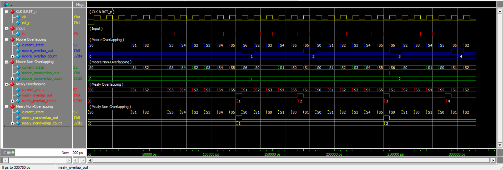

# Sequence Detector (110101)

## 1. Project Overview

This project implements a **digital sequence detector** that identifies the 6-bit binary pattern **`110101`** on a serial input stream. The detector is built using **Finite State Machines (FSMs)** in SystemVerilog, and is implemented in **four different design styles** to compare their behavior, structure, and output timing:

1. Moore Overlapping
2. Moore Non-Overlapping
3. Mealy Overlapping
4. Mealy Non-Overlapping

All four designs are verified using a single shared testbench that applies the same input stream to each detector in parallel and checks the number of detections against expected values.

## 2. Project Objective

The objective of this project is to design, implement, and verify a sequence detector for the pattern `110101` while demonstrating the key architectural differences between:

- **Moore machines** vs **Mealy machines**
- **Overlapping detection** vs **Non-overlapping detection**

The project also serves as a practical study of FSM design trade-offs in digital IC / FPGA design.

## 3. Sequence Pattern

The target sequence to be detected is:

```
110101
```

Whenever this exact 6-bit pattern appears on the serial input `in` (sampled on the rising edge of `clk`), the detector asserts its output.

## 4. FSM Implementations

### Moore Overlapping (`Moore_Overlapping.sv`)
A 7-state Moore FSM (`S0`–`S6`). The output is `1` only when the FSM is in the final state `S6` (pattern fully detected). After detection, the FSM allows overlapping matches by transitioning back into the state that reflects the already-consumed `1` bits, rather than resetting completely to `S0`.

### Moore Non-Overlapping (`Moore_NonOverlapping.sv`)
Structurally identical to the overlapping version (same 7 states `S0`–`S6`), except that once state `S6` is reached, the FSM **always returns to `S0`** regardless of the next input, discarding any bits that could have started a new overlapping match.

### Mealy Overlapping (`Mealy_Overlapping.sv`)
A 6-state Mealy FSM (`S0`–`S5`). The output is asserted combinationally in state `S5` when `in = 1` (i.e., the 6th bit completes the pattern). On detection, the FSM transitions to `S1` (instead of `S0`), preserving the last `1` bit so overlapping sequences starting with that bit can still be detected.

### Mealy Non-Overlapping (`Mealy_NonOverlapping.sv`)
Structurally identical to the Mealy Overlapping FSM (states `S0`–`S5`), but on detection in state `S5` with `in = 1`, the next state is forced back to `S0`, discarding the overlap opportunity.

## 5. Moore vs Mealy

| Aspect | Moore FSM | Mealy FSM |
|---|---|---|
| Output depends on | Current state only | Current state **and** current input |
| Output logic | Registered with the state (assigned per state) | Combinational, evaluated within the transition logic |
| Number of states used here | 7 (`S0`–`S6`) | 6 (`S0`–`S5`) |
| Output timing | Output becomes valid once the FSM settles into the detecting state | Output can react within the same clock edge as the triggering input |

The key rule demonstrated in this project:

- **Moore** → output = f(current_state)
- **Mealy** → output = f(current_state, input)

## 6. Overlapping vs Non-Overlapping

- **Overlapping detection:** After a match is found, the FSM does not fully reset. It reuses the trailing bits of the just-detected sequence if they could also be the beginning of a new match. This allows consecutive, overlapping occurrences of `110101` to be counted.
- **Non-overlapping detection:** After a match is found, the FSM resets completely to its initial state, so any bits that were part of the previous match cannot be reused to start counting a new match.

This is reflected directly in the next-state logic of the final detecting state. For example, in the Moore designs, only the transition out of `S6` differs between the overlapping and non-overlapping versions:

**Overlapping (`Moore_Overlapping.sv`):**
```systemverilog
// Transition to S2 for overlapping detection
S6: next_state = in ? S2 : S0;
```

**Non-Overlapping (`Moore_NonOverlapping.sv`):**
```systemverilog
// Non-Overlapping: After detecting 110101, restart from S0
S6: next_state = in ? S0 : S0;
```

Similarly, for the Mealy designs, only the transition out of `S5` on detection differs:

**Overlapping (`Mealy_Overlapping.sv`):**
```systemverilog
S5: begin
    if (in) begin
        // 110101 detected
        next_state = S1; // Transition to S1 for overlapping detection
        out = 1'b1;
    end
    else begin
        next_state = S0;
        out = 1'b0;
    end
end
```

**Non-Overlapping (`Mealy_NonOverlapping.sv`):**
```systemverilog
S5: begin
    if (in) begin
        // 110101 detected
        next_state = S0;
        out = 1'b1;
    end
    else begin
        next_state = S0;
        out = 1'b0;
    end
end
```

## 7. State Diagram

- Moore FSM state diagram: [Moore State Diagram](Moore_State_diagram.png)
- Mealy FSM state diagram: [Mealy State Diagram](Mealy_State_diagram.png)

## 8. Design Architecture

All four FSMs share the same general architecture:

- A synchronous state register (`always @(posedge clk or negedge rst_n)`) that updates `current_state` on the clock edge, with active-low asynchronous reset to `S0`.
- A next-state logic block (`always @(*)`) implemented as a `case` statement over `current_state`.
- Output logic that is either state-based (Moore) or combined with the next-state logic (Mealy).

Example of the common state register structure (shared across all four designs):

```systemverilog
always @(posedge clk or negedge rst_n) begin
    if (!rst_n)
        current_state <= S0;
    else
        current_state <= next_state;
end
```

The overall design and module relationships are illustrated here: [Design](Design.png)

## 9. Module Description

| Module | File | States | Style | Detection Mode |
|---|---|---|---|---|
| `moore_overlapping` | `Moore_Overlapping.sv` | S0–S6 | Moore | Overlapping |
| `moore_nonoverlapping` | `Moore_NonOverlapping.sv` | S0–S6 | Moore | Non-Overlapping |
| `mealy_overlapping` | `Mealy_Overlapping.sv` | S0–S5 | Mealy | Overlapping |
| `mealy_nonoverlapping` | `Mealy_NonOverlapping.sv` | S0–S5 | Mealy | Non-Overlapping |

Each module has the same port interface:

```systemverilog
module <fsm_name> (
    input  wire clk,
    input  wire rst_n,
    input  wire in,
    output reg  out
);
```

## 10. Verification

Verification is performed using [Simulation Transcript](Results/transcript_Result), which is the transcript log of the simulation run.

The testbench (`TestBench.sv`) instantiates all four FSM modules simultaneously and drives them with the **same clock and input sequence**, so all designs are verified under identical conditions in a single run.

It applies the following input bit stream to all four detectors:

```
00111011010110101011010110101
```

The testbench uses `negedge clk` sampling to count detections for each design:
- Mealy outputs are counted on `negedge clk` after each input transition (since Mealy output changes combinationally with the input).
- Moore outputs are counted on `negedge clk` after the FSM has settled into its output-generating state.

Expected detection counts for this input sequence:

| Detection Mode | Expected Count |
|---|---|
| Overlapping | 4 |
| Non-Overlapping | 2 |

At the end of simulation, the testbench compares the actual counts from all four FSMs against these expected values and reports a pass/fail result.

## 11. Simulation Results

The simulation was run and produced the following results:

```
Input Sequence: 00111011010110101011010110101

Expected Results:
Overlapping     = 4 detections
Non-Overlapping = 2 detections

Actual Results:
Moore Overlapping     = 4
Moore Non-Overlapping = 2
Mealy Overlapping     = 4
Mealy Non-Overlapping = 2

TEST PASSED
Errors: 0, Warnings: 0
```

All four FSM implementations produced results that matched the expected detection counts, and the testbench reported a final **TEST PASSED** status.

## 12. Waveform

The simulation waveform showing the input sequence and the corresponding outputs of all four FSMs is available here:

[Waveform](Results/WaveForm.png)


## 13. Project Files

```
Sequence Detector (110101)/
├── Results/
│   ├── WaveForm.png
│   ├── transcript_Result
│   └── w.v
├── Design.png
├── Moore_State_diagram.png
├── Mealy_State_diagram.png
├── Moore_Overlapping.sv
├── Moore_NonOverlapping.sv
├── Mealy_Overlapping.sv
├── Mealy_NonOverlapping.sv
└── TestBench.sv
```

- [Design](Design.png) — overall design/architecture illustration
- [Moore State Diagram](Moore_State_diagram.png) — state diagram used by both Moore implementations
- [Mealy State Diagram](Mealy_State_diagram.png) — state diagram used by both Mealy implementations
- `Moore_Overlapping.sv` / `Moore_NonOverlapping.sv` — Moore FSM implementations
- `Mealy_Overlapping.sv` / `Mealy_NonOverlapping.sv` — Mealy FSM implementations
- `TestBench.sv` — verification file that instantiates and drives all four FSM designs
- [Simulation Transcript](Results/transcript_Result) — recorded simulation log
- [Waveform](Results/WaveForm.png) — waveform capture of the simulation

## 14. Tools Used

- **SystemVerilog** (RTL and testbench)
- **Questa Sim-64** (Siemens EDA) — used for simulation

## 15. Conclusion

This project demonstrates four complementary approaches to designing a `110101` sequence detector: Moore vs. Mealy output styles, and overlapping vs. non-overlapping detection logic. Despite their structural differences, all four designs were verified against the same input sequence and correctly produced the expected number of detections, with the testbench confirming a **TEST PASSED** result with zero errors and zero warnings.
```
