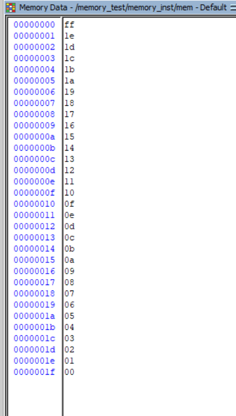
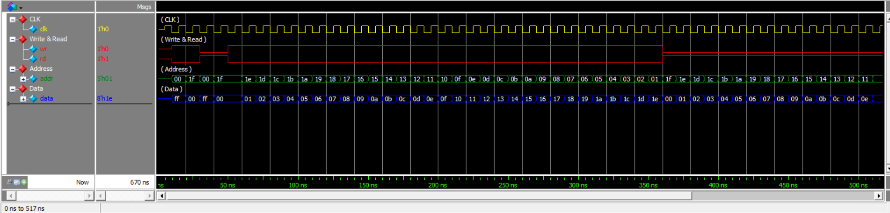

# Single-Bidirectional-Port Memory (Verilog)

A parameterized memory with a **single bidirectional data port**, implemented in Verilog HDL and verified with two self-checking testbenches — an original procedural version and a task-based version.



---

## 1. Overview

This project implements a synchronous-write / continuous-read memory in which a **single `inout` bus** is used for both writing data into the memory and reading data out of it. When the memory is not driving the bus, it releases it to high impedance (`Z`) so the testbench can drive it instead.

| Parameter | Default | Meaning |
|---|---|---|
| `AWIDTH` | 5 | Address width → 2⁵ = **32 memory locations** |
| `DWIDTH` | 8 | Data width → **8 bits per location** |

| Signal | Direction | Width | Description |
|---|---|---|---|
| `clk` | input | 1 | Clock. Writes occur on the positive edge. |
| `wr` | input | 1 | Write enable. |
| `rd` | input | 1 | Read enable (drives the data bus). |
| `addr` | input | `AWIDTH` | Address of the accessed location. |
| `data` | inout | `DWIDTH` | Bidirectional data bus. |

---

## 2. Objective

- Model a parameterized memory array in Verilog.
- Implement a **single bidirectional data port** using tri-state behavior.
- Distinguish **synchronous write** from **continuous (asynchronous) read**.
- Verify the design with a self-checking testbench.
- Apply the lab concept of **encapsulating memory test procedural behaviors in tasks**.

---

## 3. Memory Architecture

```
                 +----------------------+
                 |       MEMORY         |
                 |                      |
addr ----------->| Address              |
wr ------------->| Write Control        |
rd ------------->| Read Control         |
clk ------------>| Clock                |
                 |                      |
data <---------->| Bidirectional Bus    |
                 +----------------------+
```

---

## 4. Parameterized Memory Structure

The storage array is declared as:

```verilog
reg [DWIDTH-1:0] mem [0:(1<<AWIDTH)-1];
```

- `(1 << AWIDTH)` is a left shift of `1` by `AWIDTH` bits, which evaluates to **2^AWIDTH** — the number of addressable locations.
- Each element of the array is `DWIDTH` bits wide.

With the default parameters:

```
AWIDTH = 5  ->  (1 << 5) = 32 locations
DWIDTH = 8  ->  8 bits per location

Memory size = 32 × 8 bits
```

Changing `AWIDTH` or `DWIDTH` at instantiation resizes the array automatically — no edit to the RTL body is required.

---

## 5. Bidirectional Data Bus

A single `inout` port carries data in both directions, so only one side may drive it at any time:

**During write**

```
Testbench  --->  data bus  --->  Memory
```

The memory does not drive the bus (`rd = 0`, bus is `Z` from the memory side), so the testbench value reaches `mem[addr]`.

**During read**

```
Memory  --->  data bus  --->  Testbench
```

The memory drives `mem[addr]` onto the bus (`rd = 1`), and the testbench releases its driver by driving `'bz`.

This handshake is what makes the bidirectional port work: **whichever side is not driving must go to high impedance**, otherwise the bus would be contended.

---

## 6. Read and Write Operations

### RTL

```verilog
// Memory Write  (synchronous)
always @(posedge clk) begin
    if (wr)
        mem[addr] <= data;
end

// Memory Read   (continuous / tri-state)
assign data = rd ? mem[addr] : {DWIDTH{1'bz}};
```

**Write** — On the positive edge of `clk`, if `wr` is high, the value present on the bidirectional bus is stored into `mem[addr]`. The write is therefore fully synchronous.

**Read** — The read path is a continuous assignment, not a clocked one. When `rd` is high, `mem[addr]` is driven onto `data` combinationally; when `rd` is low, the memory drives `{DWIDTH{1'bz}}`, releasing the bus. The replication `{DWIDTH{1'bz}}` keeps the high-impedance constant correctly sized for any `DWIDTH`.

---

## 7. Verification Approach

Both testbenches verify the **same DUT** (`memory.v`). They differ only in how the stimulus is organized:

| File | Style | Purpose |
|---|---|---|
| `memory_test.v` | Procedural | Original testbench — write/read sequences written inline. |
| `memory_test2.v` | Task-based | Modified testbench — same sequence, encapsulated in reusable tasks. |

Both instantiate the memory with `AWIDTH = 5`, `DWIDTH = 8`, drive the bus through a `rdata` register (`assign data = rdata;`), and release it with `'bz` before every read.

### Tests Performed

1. Basic write operations.
2. Basic read operations.
3. Writing ascending data to descending addresses.
4. Reading the stored data back from descending addresses.
5. Data integrity across the memory address range.
6. Correct operation of the bidirectional data bus.
7. Correct high-impedance behavior during read/write direction changes.

The exhaustive traversal loop runs `while (addr)`, covering addresses from **31 down to 1** while the written data increments from 0 upward, then reads the same range back and checks every value.

---

## 8. Original Testbench — `memory_test.v`

This is the original testbench used for the memory verification. The write and read operations are performed directly inside the test procedure: for each access it sets `wr`/`rd`, drives `addr` and `rdata`, waits for `@(negedge clk)`, and — for reads — calls `expect` to compare the bus against the expected value.

```verilog
task expect;
  input [DWIDTH-1:0] exp_data;
  if (data !== exp_data) begin
    $display("TEST FAILED");
    $display("At time %0d addr=%b data=%b", $time, addr, data);
    $display("data should be %b", exp_data);
    $finish;
  end
  else begin
    $display("At time %0d addr=%b data=%b", $time, addr, data);
  end
endtask
```

Example of an inline read from the original testbench:

```verilog
wr=0; rd=1; memory_test.addr=addr; rdata='bz; @(negedge clk) expect(data);
```

The `!==` comparison is used deliberately so that `X` and `Z` mismatches are also caught.

---

## 9. Task-Based Testbench — `memory_test2.v`

This is the modified version created to apply the lab concept:

> **Encapsulate memory test procedural behaviors in tasks.**

The repeated control-signal sequences are moved into reusable tasks, so the test body only states *what* is being written or read.

### `task expect` — check actual vs. expected

```verilog
task expect;
    input [DWIDTH-1:0] exp_data;
    if (data !== exp_data) begin
    $display("TEST FAILED");
    $display("At time %0d addr=%b data=%b", $time, addr, data);
    $display("data should be %b", exp_data);
    $finish;
    end
else begin 
    $display("At time %0d addr=%b data=%b", $time, addr, data);
end 
endtask
```

### `task write_mem` — encapsulated write procedure

```verilog
task write_mem;
    input [AWIDTH-1:0] write_addr;
    input [DWIDTH-1:0] write_data;

    wr   = 1'b1;
    rd   = 1'b0;
    addr = write_addr;
    rdata = write_data;

    @(negedge clk);
endtask
```

### `task read_mem` — encapsulated read procedure + check

```verilog
task read_mem;
    input [AWIDTH-1:0] read_addr;
    input [DWIDTH-1:0] expected_data;

    wr    = 1'b0;
    rd    = 1'b1;
    addr  = read_addr;
    rdata = {DWIDTH{1'bz}};

    @(negedge clk);
    expect(expected_data);
endtask
```

Note how `read_mem` drives `rdata` to `{DWIDTH{1'bz}}` before sampling — the testbench releases the bus so the memory can drive it, then `expect` verifies the returned value.

The exhaustive loop becomes very compact as a result:

```verilog
test_addr = -1;
test_data = 0;
while (test_addr) begin
    read_mem(test_addr, test_data);
    test_addr = test_addr - 1'b1;
    test_data = test_data + 1'b1;
end
```

**Why this is an improvement**

- Removes repeated blocks of control-signal assignments.
- Makes write/read operations reusable anywhere in the test.
- Keeps the verification sequence readable and structured.
- Demonstrates task-based procedural modeling in a Verilog testbench.

---

## 10. Simulation Results

### Original testbench (`transcript_1`)

```
# At time 650 addr=00011 data=00011100
# At time 660 addr=00010 data=00011101
# At time 670 addr=00001 data=00011110
# TEST PASSED
```

**TEST PASSED — Errors: 0, Warnings: 0**

### Task-based testbench (`transcript_2`)

```
# ==============================================
#              MEMORY VERIFICATION              
# ==============================================
# TEST PASSED
# Errors: 0
# Warnings: 0
# ==============================================
```

**TEST PASSED — Errors: 0, Warnings: 0**

Both runs complete the full address traversal and finish at simulation time **670 ns**, producing identical checked data across the memory range — confirming that refactoring the stimulus into tasks did not change the verification behavior.

---

## 11. Waveform



The waveform shows:

- **Clock activity** driving the memory accesses.
- **Write and read control** (`wr` / `rd`) switching between write and read phases.
- **Address changes** as the test walks through the memory locations.
- **Bidirectional data behavior** on the shared `data` bus, including high-impedance intervals when neither side is driving.
- **Correct stored/read-back values** matching the expected data during the read phase.

---

## 12. Project Files

| File | Description |
|---|---|
| `memory.v` | Parameterized single-bidirectional-port memory RTL. |
| `memory_test.v` | Original procedural testbench. |
| `memory_test2.v` | Modified task-based testbench using reusable write/read/check tasks. |
| `Results/Memory.png` | Memory design/representation image. |
| `Results/WaveForm.png` | Simulation waveform. |
| `Results/transcript_1` | Simulation transcript (original testbench). |
| `Results/transcript_2` | Simulation transcript (task-based testbench). |

---

## 13. Tools Used

- Verilog HDL
- Questa/ModelSim

---

## 14. Conclusion

This project demonstrates:

- **Parameterized memory modeling** using `AWIDTH` / `DWIDTH` and a `(1<<AWIDTH)`-sized array.
- **Single bidirectional data-port design** with one `inout` bus shared by both directions.
- **Synchronous write** on the positive clock edge under `wr`.
- **Continuous/asynchronous read** through a combinational assignment under `rd`.
- **Tri-state/high-impedance bus behavior** so that only one driver is active at a time.
- **Task-based testbench organization** applying the concept of encapsulating memory test procedural behaviors in tasks.
- **Self-checking verification** with the `expect` task and `!==` comparison.
- **Successful simulation** — both testbenches report TEST PASSED with Errors: 0 and Warnings: 0.
```
